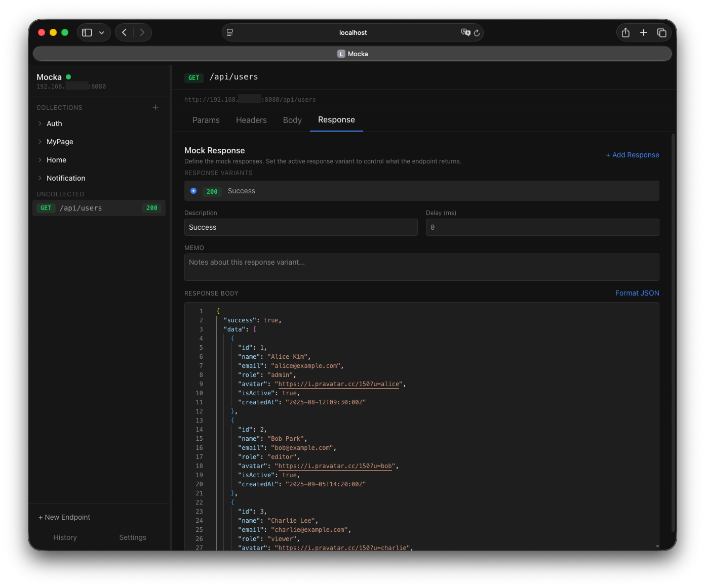

<div align="center">

# Mocka

**크로스 플랫폼 웹 기반 HTTP Mock 서버**

[English](../README.md)

[](https://nodejs.org/)
[](https://www.typescriptlang.org/)
[](https://react.dev/)
[](https://fastify.dev/)
[](LICENSE)



</div>

## 소개

Mocka는 브라우저에서 Mock API endpoint를 생성, 관리, 제공할 수 있는 웹 기반 HTTP Mock 서버입니다. HTTP 메서드, 경로, 상태 코드, 헤더, 응답 본문을 자유롭게 설정하고, 클라이언트 애플리케이션에서 Mock 서버로 요청을 보내면 설정된 응답을 반환합니다.

애플리케이션은 두 개의 서버로 구성됩니다. 관리 UI와 REST API를 제공하는 **Admin API** (기본 포트 3000)와, 설정된 endpoint에 따라 요청을 처리하는 **Mock Server** (기본 포트 8080)입니다. 모든 데이터는 로컬 SQLite 데이터베이스에 저장되므로 서버를 재시작해도 설정이 유지됩니다.

## 주요 기능

- **완전한 로컬 실행** — 클라우드, 계정, 호출 제한 없이 오프라인에서도 동작. 같은 Wi-Fi의 실제 디바이스에서 로컬 네트워크 IP로 Mock API 호출 가능
- **다중 응답 변형** — endpoint당 여러 응답(성공, 에러 등)을 정의하고 클릭 한 번으로 즉시 전환
- **동적 템플릿** — 30+ 내장 변수(`{{$randomUUID}}`, `{{$randomEmail}}` 등)와 요청 컨텍스트 헬퍼(`{{$body 'field'}}`, `{{$pathParams 'id'}}`)로 실제와 유사한 Mock 데이터 생성
- **조건부 매칭** — 요청 body, header, query/path param 기반으로 AND/OR 룰 로직을 통해 응답 변형 자동 선택
- **Path Parameter** — `:param` 또는 `{param}` 문법으로 동적 경로 정의. 정확 경로가 패턴보다 우선
- **환경 변수** — dev/staging/production 환경별 변수 관리. 응답에서 `{{variableName}}`으로 참조하고 즉시 전환
- **Import / Export** — endpoint를 JSON으로 내보내고 불러오기. 충돌 해결(건너뛰기, 덮어쓰기, 병합) 지원
- **실시간 로깅** — WebSocket을 통해 수신 요청을 실시간으로 모니터링
- **응답 지연** — 변형별 또는 전역으로 레이턴시 시뮬레이션. `x-mock-response-delay` 헤더로 요청별 오버라이드 가능

## 아키텍처

```
┌─────────────────────────────────────────────────────────┐
│  브라우저 (React SPA)                                    │
│  http://localhost:5173 (dev) / http://localhost:3000     │
└──────────┬──────────────────────────────────────────────┘
           │ REST API + WebSocket
           ▼
┌──────────────────────┐       ┌──────────────────────┐
│  Admin API (:3000)   │       │  Mock Server (:8080)  │
│  - Endpoint CRUD     │       │  - Mock 응답 제공      │
│  - Collection 관리    │       │  - 요청 기록           │
│  - 설정 관리          │       │                        │
│  - 정적 파일 제공      │       │                        │
└──────────┬───────────┘       └────────────────────────┘
           │
           ▼
    ┌──────────────┐
    │  SQLite DB   │
    └──────────────┘
```

Admin API가 endpoint 설정을 관리하고 프론트엔드를 제공하며, Mock Server는 수신 요청을 설정된 응답에 동적으로 라우팅합니다.

## 기술 스택

| 영역 | 기술 |
|------|------|
| Backend | Node.js, Fastify, TypeScript, better-sqlite3 |
| Frontend | React, Vite, Zustand, Tailwind CSS, Monaco Editor |
| Infra | npm workspaces, SQLite |

## 시작하기

### 사전 요구사항

- **Node.js** 20+
- **npm** 7+

### 빠른 시작

```bash
git clone https://github.com/ljdongz/Mocka.git
cd mocka
npm install                   # 의존성 설치
npm run build && npm start    # 빌드 후 서버 시작
```

관리 UI와 Mock 서버가 다음 주소에서 실행됩니다:

| 서비스 | URL | 설명 |
|--------|-----|------|
| Admin UI | `http://localhost:3000` | 관리 UI + REST API |
| Mock Server | `http://localhost:8080` | Mock 응답 제공 |

### 환경 변수

| 변수 | 기본값 | 설명 |
|------|--------|------|
| `ADMIN_PORT` | `3000` | Admin API 포트 |
| `MOCK_PORT` | `8080` | Mock Server 포트 |

```bash
# 예시: 커스텀 포트로 실행
ADMIN_PORT=4000 MOCK_PORT=9090 npm start
```

### 개발 모드

Mocka에 기여하려면 개발 모드를 사용합니다. 프로덕션 모드와 달리 별도의 Vite dev server가 코드 변경을 감지하여 브라우저를 자동으로 새로고침(HMR)하므로, 재빌드 없이 수정 사항을 즉시 확인할 수 있습니다.

```bash
npm run dev
```

세 개의 서버가 동시에 시작됩니다:

| 서비스 | URL | 설명 |
|--------|-----|------|
| Vite Dev Server | `http://localhost:5173` | HMR을 지원하는 프론트엔드 |
| Admin API | `http://localhost:3000` | REST API + WebSocket |
| Mock Server | `http://localhost:8080` | Mock 응답 제공 |

## 사용법

1. 관리 UI에 접속합니다: `http://localhost:3000`
2. **Collection을 생성**하여 endpoint를 그룹으로 정리합니다
3. **Mock endpoint를 추가**합니다 — 메서드, 경로, 상태 코드, 헤더, 응답 본문을 설정합니다
4. Mock 서버로 **요청을 전송**합니다:

```bash
# 예시: Mock endpoint에 GET 요청
curl http://localhost:8080/api/users

# 예시: POST 요청
curl -X POST http://localhost:8080/api/users \
  -H "Content-Type: application/json" \
  -d '{"name": "John"}'

# 예시: Path parameter — /api/users/:id 로 정의된 endpoint에 매칭
curl http://localhost:8080/api/users/42

# 예시: 헤더로 응답 변형 오버라이드
curl http://localhost:8080/api/users \
  -H "x-mock-response-code: 404"

curl http://localhost:8080/api/users \
  -H "x-mock-response-name: error" \
  -H "x-mock-response-delay: 2"
```

5. 응답 본문에 **템플릿 변수**를 사용하여 동적 데이터를 생성합니다:

```json
{
  "id": "{{$randomUUID}}",
  "name": "{{$randomFullName}}",
  "email": "{{$randomEmail}}",
  "createdAt": "{{$isoTimestamp}}"
}
```

6. **요청 컨텍스트 헬퍼**를 사용하여 수신 요청 데이터를 응답에 반영합니다:

```json
{
  "receivedName": "{{$body 'user.name'}}",
  "authToken": "{{$headers 'authorization'}}",
  "searchQuery": "{{$queryParams 'q'}}",
  "userId": "{{$pathParams 'id'}}"
}
```

7. **환경 변수**를 설정하여 다양한 구성(dev, staging, production)을 관리합니다. 응답 본문에서 `{{variableName}}` 문법으로 참조합니다.

> **Tip:** Mock 서버는 로컬 네트워크 IP에서도 접근할 수 있습니다 (시작 시 콘솔에 표시). 같은 네트워크의 다른 기기에서도 요청을 보낼 수 있습니다 — 예: `curl http://192.168.x.x:8080/api/users`. 모바일 앱이나 다른 클라이언트를 테스트할 때 유용합니다.

8. 관리 UI의 요청 기록에서 **수신 요청을 실시간으로 모니터링**합니다

## 프로젝트 구조

```
mocka/
├── client/                 # React 프론트엔드
│   ├── src/
│   │   ├── api/            # API 클라이언트 함수
│   │   ├── components/     # React 컴포넌트
│   │   ├── hooks/          # 커스텀 훅
│   │   ├── i18n/           # 번역 파일 (en, ko)
│   │   ├── stores/         # Zustand 스토어
│   │   ├── types/          # TypeScript 타입
│   │   └── utils/          # 유틸리티 함수
│   └── vite.config.ts
├── server/                 # Fastify 백엔드
│   ├── src/
│   │   ├── db/             # 데이터베이스 연결 및 스키마
│   │   ├── models/         # 데이터 모델
│   │   ├── plugins/        # Fastify 플러그인 (WebSocket 등)
│   │   ├── repositories/   # 데이터 접근 계층
│   │   ├── routes/         # API 라우트 핸들러
│   │   ├── services/       # 비즈니스 로직
│   │   ├── utils/          # 유틸리티 함수
│   │   ├── __tests__/      # 단위 테스트 (Vitest)
│   │   ├── admin-server.ts # Admin API 서버
│   │   ├── mock-server.ts  # Mock 서버
│   │   └── index.ts        # 진입점
│   └── data/               # SQLite 데이터베이스 파일
└── package.json            # Workspace 루트
```

## 스크립트

| 명령어 | 설명 |
|--------|------|
| `npm install` | 모든 의존성 설치 (server + client) |
| `npm run dev` | 개발 모드로 두 서버 동시 시작 |
| `npm run dev:server` | 백엔드만 시작 (핫 리로드) |
| `npm run dev:client` | 프론트엔드만 시작 (Vite dev server) |
| `npm run build` | 클라이언트와 서버를 프로덕션용으로 빌드 |
| `npm start` | 프로덕션 서버 시작 |
| `npm test -w server` | 서버 단위 테스트 실행 |
| `npm stop` | 실행 중인 Mocka 프로세스 종료 |

## 기여하기

기여를 환영합니다! 아래 절차를 따라주세요:

1. 저장소를 **Fork** 합니다
2. 기능 **브랜치를 생성**합니다 (`git checkout -b feature/my-feature`)
3. 변경 사항을 **커밋**합니다 (`git commit -m 'Add my feature'`)
4. 브랜치에 **Push**합니다 (`git push origin feature/my-feature`)
5. **Pull Request**를 생성합니다

## 라이선스

이 프로젝트는 [MIT License](LICENSE)를 따릅니다.
